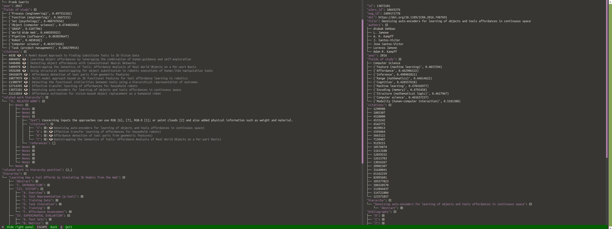

# OAPapersViewer
TUI viewer for OAPapers corpus and derived datasets.

You can find the home repository of the OAPapers project at [https://github.com/KNOT-FIT-BUT/OAPapers](https://github.com/KNOT-FIT-BUT/OAPapers)



## Install

    pip install oapapersviewer

## Usage

An example of loading OARelatedWork dataset with references:

```python
oapapersviewer train.jsonl -r references.jsonl -rw
```

# Cite

If you use the dataset or the corpus, please cite the following paper:

```bibtex
@article{docekal2024oarelatedwork,
      title={OARelatedWork: A Large-Scale Dataset of Related Work Sections with Full-texts from Open Access Sources}, 
      author={Martin Docekal and Martin Fajcik and Pavel Smrz},
      year={2024},
      eprint={2405.01930},
      archivePrefix={arXiv},
      primaryClass={cs.CL}
}
```